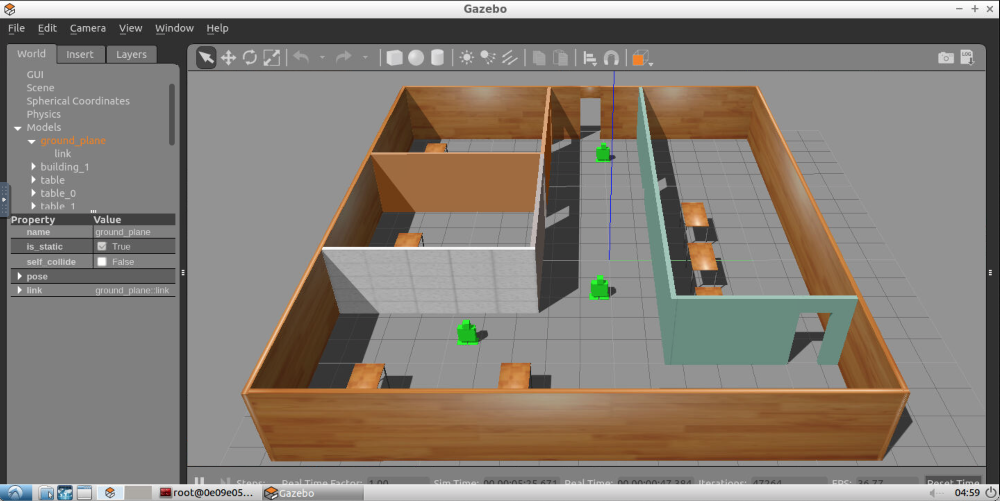

# RobotND - Build My World

This is the first project for the Udacity [Robotics Software Engineer](https://www.udacity.com/course/robotics-software-engineer--nd209) course. The objective of this project is to build an office with robots in Gazabo



## How to build
```
mkdir build
cd build
cmake ../
make
```

## How to run
```
cd world
gazebo UdacityOffice.world
```
